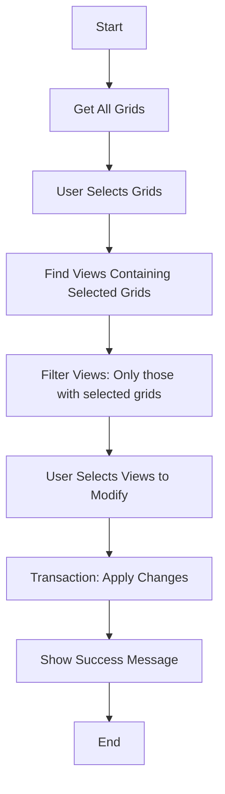
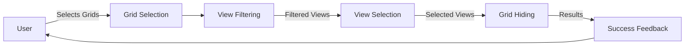

# Grid Hiding Architecture

## Overview
This document describes the enhanced GridViewLocator functionality that allows users to hide selected grids from specific views.

## Workflow

## Components

### 1. Grid Selection (Existing)
- `get_all_grids()` - Gets all grids in document
- `show_grid_selection_dialog()` - User selects which grids to work with

### 2. View Filtering (Existing)
- `find_views_containing_grids()` - Finds views that contain selected grids
- Returns structured data about grid-view relationships

### 3. View Selection (New)
- `show_view_selection_dialog()` - User selects which views to modify
- Shows only views that contain the selected grids

### 4. Grid Hiding (New)
- `hide_grids_in_views()` - Applies the visibility changes
- Uses Revit transactions for proper undo/redo support
- Handles errors gracefully

### 5. Success Feedback (New)
- `show_success_message()` - Confirms changes were applied
- Shows count of grids hidden and views modified

## Data Flow

## Technical Requirements

### Revit API Usage
- `Transaction` - For proper change management
- `Grid.SetHide()` - To hide grids in specific views
- `FilteredElementCollector` - For efficient element collection
- `forms.SelectFromList` - For user selection dialogs

### Error Handling
- Validate all inputs before processing
- Handle cases where grids/views are deleted during operation
- Provide meaningful error messages
- Allow graceful cancellation at any point

### Performance
- Cache view-sheet relationships to avoid redundant API calls
- Use sets for efficient lookups
- Provide progress feedback for large operations
- Minimize Revit API calls in loops

## User Experience

### Before Changes
1. User selects grids to locate
2. Script finds views containing those grids
3. Results displayed in output window
4. **Process ends**

### After Changes
1. User selects grids to hide
2. Script finds views containing those grids
3. User selects which views to modify
4. **Changes applied automatically in transaction**
5. **Success message shown** - "Successfully hid X grids from Y views"

## Safety Features

- **Transaction**: Proper undo/redo support
- **Validation**: Check that grids are actually visible before hiding
- **Error Recovery**: Graceful handling of edge cases
- **Direct Execution**: Changes applied immediately after view selection

## Implementation Plan

1. ✅ Fix import errors
2. ✅ Optimize performance
3. ✅ Convert to print output
4. ✅ Fix IronPython compatibility
5. ⏳ Add view selection dialog
6. ⏳ Add grid hiding logic
7. ⏳ Update main workflow
8. ⏳ Test thoroughly

## Testing Scenarios

1. **Basic Flow**: Select grids → select views → apply changes automatically
2. **Edge Cases**: No grids found, no views found, empty selections
3. **Error Cases**: Deleted elements, permission issues
4. **Performance**: Large projects with many grids/views
5. **Undo/Redo**: Verify transaction works with Revit undo
6. **Validation**: Ensure only visible grids can be hidden