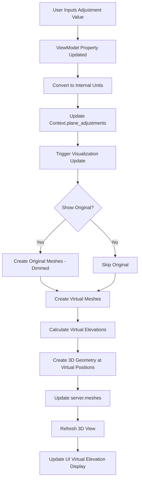

# Enhancement Plan: View Range Virtual Adjustment Feature

## Executive Summary

Menambahkan fitur **Virtual View Range Preview** yang memungkinkan user untuk melakukan "what-if" analysis dengan memasukkan offset adjustment untuk setiap plane, menvisualisasikan hasil adjustment di 3D view tanpa mengubah view range asli di Revit.

---

## Current State Analysis

### Existing UI (MainWindow.xaml)
- **Layout**: Simple grid displaying 4 planes dengan color indicator
- **Data Display**: Read-only elevation values untuk:
  - Top Clip Plane (Orange)
  - Cut Plane (Red) - **visualized in 3D**
  - Bottom Clip Plane (Blue)
  - View Depth Plane (Green) - **visualized in 3D**
- **Window Size**: 400x230 pixels
- **Interaction**: Pasif, hanya menampilkan informasi

### Existing Logic (script.py)
- **Visualization**: Hanya Cut Plane dan View Depth yang ditampilkan di 3D
- **Data Flow**: 
  1. User selects plan view di project browser
  2. Script extracts view range data
  3. Creates 3D meshes at actual elevations
  4. Displays elevation values in UI
- **Update Triggers**: View activation, selection change, document change

---

## Enhancement Requirements

### Functional Requirements

1. **FR-1: Adjustment Input**
   - User dapat memasukkan offset value (+ atau -) untuk setiap plane
   - Input dalam unit yang sama dengan project display unit
   - Support decimal values (e.g., +500, -250, +100.5)

2. **FR-2: Virtual Visualization**
   - Menampilkan preview plane di 3D dengan adjusted elevation
   - Virtual planes dibedakan dengan transparansi atau warna yang berbeda
   - Original planes tetap visible (opsional, via toggle)

3. **FR-3: Real-time Update**
   - Visualisasi update otomatis saat user mengubah adjustment value
   - Debounce input untuk performa (update setelah 300-500ms idle)

4. **FR-4: Reset Capability**
   - Button untuk reset semua adjustment ke 0
   - Restore visualization ke state asli

5. **FR-5: Visual Feedback**
   - Display calculated virtual elevation (actual + adjustment)
   - Clear indication: "Original" vs "Adjusted"
   - Delta value display (optional)

### Non-Functional Requirements

1. **NFR-1: Performance**
   - Update visualization < 100ms untuk responsiveness
   - Tidak menambah beban signifikan pada existing logic

2. **NFR-2: Compatibility**
   - Maintain Revit 2024-2026 compatibility
   - Tidak break existing functionality

3. **NFR-3: User Experience**
   - Intuitive interface, minimal learning curve
   - Clear visual hierarchy
   - Tidak overwhelming dengan terlalu banyak kontrol

---

## Proposed Solution Design

### 1. UI Enhancement Design

#### Layout Strategy
```
┌─────────────────────────────────────────────────────────┐
│ View Range Helper                          [X]           │
├─────────────────────────────────────────────────────────┤
│ Showing View Range of                                    │
│ [Level 1 - Structural Plan]                             │
├─────────────────────────────────────────────────────────┤
│ Plane         │ Original │ Adjustment │ Virtual          │
│               │ (mm)     │ (mm)       │ (mm)             │
├───────────────┼──────────┼────────────┼─────────────────┤
│ ● Top         │ 4500     │ [+100   ]  │ → 4600          │
│ ● Cut         │ 1200     │ [-200   ]  │ → 1000  ✓       │
│ ● Bottom      │ 0        │ [  0    ]  │ → 0             │
│ ● Depth       │ -400     │ [+50    ]  │ → -350  ✓       │
├───────────────┴──────────┴────────────┴─────────────────┤
│ [x] Show Original Planes    [ Reset All ]               │
│                                                          │
│ Note: Only Cut & Depth planes shown in 3D               │
│ ✓ = Visualized in 3D view                               │
└─────────────────────────────────────────────────────────┘
```

#### UI Components to Add

1. **New Grid Column**: "Adjustment"
   - TextBox inputs for each plane
   - Accept numeric input only (+ or - prefix optional)
   - Placeholder text: "0" or "offset..."

2. **New Grid Column**: "Virtual" 
   - Calculated display (Original + Adjustment)
   - Read-only TextBlock with bold formatting
   - Arrow indicator (→) untuk clarity

3. **Controls Panel** (bottom section):
   - CheckBox: "Show Original Planes" (default: unchecked)
   - Button: "Reset All" - clear all adjustments
   - Optional: "Apply to View" button (future feature)

4. **Visual Indicators**:
   - ✓ symbol untuk planes yang di-visualize di 3D
   - Color coding tetap menggunakan existing brushes
   - Maybe highlight adjusted values dengan background color

#### Window Size Adjustment
- New size: 550x280 pixels (wider untuk accommodate columns)
- Still non-resizable untuk consistency

### 2. Data Model Enhancement

#### ViewModel Properties to Add

```python
class MainViewModel(forms.Reactive):
    # Existing properties...
    
    # New properties for adjustments (in display units)
    @forms.reactive
    def topplane_adjustment(self):
        return self._topplane_adjustment
    
    @topplane_adjustment.setter
    def topplane_adjustment(self, value):
        self._topplane_adjustment = value
        self._update_virtual_elevation('top')
    
    # Similar for cut, bottom, depth
    
    # Virtual elevations (calculated)
    @forms.reactive
    def topplane_virtual(self):
        return self._topplane_virtual
    
    # Toggle for showing original planes
    @forms.reactive
    def show_original_planes(self):
        return self._show_original_planes
    
    @show_original_planes.setter
    def show_original_planes(self, value):
        self._show_original_planes = value
        # Trigger visualization update
```

#### Context Class Enhancement

```python
class Context(object):
    def __init__(self, view_model):
        # Existing initialization...
        
        # New: Track adjustment values in internal units
        self.plane_adjustments = {
            DB.PlanViewPlane.TopClipPlane: 0.0,
            DB.PlanViewPlane.CutPlane: 0.0,
            DB.PlanViewPlane.BottomClipPlane: 0.0,
            DB.PlanViewPlane.ViewDepthPlane: 0.0
        }
    
    def context_changed(self):
        # Existing logic untuk actual planes...
        
        # New: Create virtual plane visualization
        self._create_virtual_visualization()
    
    def _create_virtual_visualization(self):
        """Create meshes for adjusted planes"""
        # Only visualize Cut and Depth with adjustments
        # Use different colors or increased transparency
        pass
```

### 3. Visualization Strategy

#### Mesh Creation Logic

**Option A: Dual Mesh (Recommended)**
- **Original Meshes**: Dashed/wireframe style, lower opacity (30%)
- **Virtual Meshes**: Solid style, normal opacity (50%)
- User can toggle original on/off via checkbox

**Option B: Single Mesh with Switch**
- Show either original OR virtual (radio button)
- Simpler but less informative

**Recommended: Option A** untuk better "before-after" comparison

#### Color Scheme for Virtual Planes

```python
VIRTUAL_PLANE_COLORS = {
    DB.PlanViewPlane.CutPlane: [255, 100, 100],      # Lighter Red
    DB.PlanViewPlane.ViewDepthPlane: [100, 255, 100]  # Lighter Green
}

ORIGINAL_PLANE_COLORS = {
    DB.PlanViewPlane.CutPlane: [180, 180, 180],      # Gray (when dimmed)
    DB.PlanViewPlane.ViewDepthPlane: [180, 180, 180] # Gray (when dimmed)
}
```

### 4. Implementation Data Flow



---

## Implementation Plan

### Phase 1: UI Enhancement (Priority: High)

**Tasks:**
1. **Modify MainWindow.xaml**
   - Add new grid columns for Adjustment and Virtual
   - Add TextBox controls with numeric validation
   - Add controls panel (checkbox, reset button)
   - Adjust window size and layout
   - Test layout responsiveness

2. **Update ViewModel**
   - Add reactive properties for adjustments (4 planes)
   - Add reactive properties for virtual elevations (4 planes)
   - Add show_original_planes toggle property
   - Implement calculation logic for virtual values
   - Add reset_all_adjustments method

**Estimated Time**: 2-3 hours

### Phase 2: Logic Enhancement (Priority: High)

**Tasks:**
3. **Enhance Context Class**
   - Add plane_adjustments dictionary
   - Implement adjustment conversion (display → internal units)
   - Modify context_changed to support virtual visualization
   - Add _create_virtual_visualization method
   - Add _create_original_visualization method (dimmed)

4. **Update Visualization Functions**
   - Modify get_color_from_plane to support virtual/original modes
   - Add create_virtual_mesh function
   - Add create_original_mesh function (optional display)
   - Implement mesh switching logic based on toggle

**Estimated Time**: 3-4 hours

### Phase 3: Event Handling & Updates (Priority: Medium)

**Tasks:**
5. **Implement Input Handling**
   - Add event handlers for adjustment TextBox changes
   - Implement input validation (numeric only, ± support)
   - Add debouncing for performance (300ms delay)
   - Handle invalid input gracefully

6. **Wire Up Controls**
   - Connect Reset button to reset_all_adjustments
   - Connect show_original_planes toggle to visualization update
   - Ensure proper external event triggers

**Estimated Time**: 2 hours

### Phase 4: Testing & Refinement (Priority: Medium)

**Tasks:**
7. **Testing**
   - Test with various adjustment values
   - Test with different unit systems (mm, feet, etc.)
   - Test with section box active/inactive
   - Test view switching behavior
   - Performance testing with rapid input changes

8. **UI/UX Refinement**
   - Adjust colors for better contrast
   - Fine-tune transparency values
   - Add tooltips for clarity
   - Polish visual feedback

**Estimated Time**: 2-3 hours

### Phase 5: Documentation (Priority: Low)

**Tasks:**
9. **Update Documentation**
   - Update README with new feature description
   - Add usage examples
   - Document calculation logic
   - Create user guide with screenshots

**Estimated Time**: 1 hour

---

## Technical Considerations

### 1. Unit Conversion Handling

```python
def adjustment_to_internal_units(adjustment_value, unit_type):
    """Convert user input adjustment to internal units (feet)"""
    try:
        return DB.UnitUtils.ConvertToInternalUnits(
            adjustment_value,
            unit_type
        )
    except:
        # Fallback for older API
        return adjustment_value / 304.8  # if mm to feet
```

### 2. Input Validation Strategy

```python
def validate_numeric_input(text):
    """Validate and parse adjustment input"""
    if not text or text.strip() == "":
        return 0.0
    
    # Remove spaces
    text = text.strip()
    
    try:
        # Try parsing as float (supports -, + prefix)
        value = float(text)
        return value
    except ValueError:
        return None  # Invalid input
```

### 3. Debouncing Implementation

```python
from System.Threading import Timer

class DebouncedUpdate:
    def __init__(self, delay_ms, callback):
        self.delay = delay_ms
        self.callback = callback
        self.timer = None
    
    def trigger(self):
        if self.timer:
            self.timer.Dispose()
        
        self.timer = Timer(
            lambda: self.callback(),
            None,
            self.delay,
            -1  # Don't repeat
        )
```

### 4. Performance Optimization

- Only update visualization for Cut and Depth planes (as per current behavior)
- Cache bounding box calculations
- Reuse mesh objects when only colors change
- Batch multiple adjustment changes into single update

---

## Risk Assessment & Mitigation

### Risk 1: Performance Impact
**Risk**: Frequent updates might slow down UI or 3D view
**Mitigation**: 
- Implement debouncing (300-500ms)
- Only update changed planes
- Cache geometry calculations

### Risk 2: Unit Conversion Errors
**Risk**: Incorrect conversion between display and internal units
**Mitigation**:
- Extensive testing across unit systems
- Add unit labels to UI
- Validate calculations against Revit's native values

### Risk 3: UI Complexity
**Risk**: Too many controls might confuse users
**Mitigation**:
- Keep original simple display
- Add adjustments as optional enhancement
- Use clear visual hierarchy
- Add tooltips and help text

### Risk 4: API Compatibility
**Risk**: New code might break Revit 2024 compatibility
**Mitigation**:
- Test on both 2024 and 2026
- Use try-except fallback patterns
- Follow existing compatibility approach

---

## Success Criteria

1. ✅ User dapat input adjustment values untuk semua 4 planes
2. ✅ Virtual planes ter-visualisasi di 3D dengan adjusted elevations
3. ✅ UI menampilkan calculated virtual elevations dengan jelas
4. ✅ Reset button mengembalikan semua ke state asli
5. ✅ Performance tetap responsif (< 100ms update)
6. ✅ Kompatibel dengan Revit 2024 dan 2026
7. ✅ Existing functionality tidak terganggu
8. ✅ Visual distinction jelas antara original dan virtual planes

---

## Future Enhancements (Out of Scope for Now)

1. **"Apply to View" Button**: Langsung apply adjustment values ke actual view range
2. **Preset Adjustments**: Save/load common adjustment patterns
3. **Measurement Tools**: Show distance between planes in 3D
4. **History**: Track adjustment history, undo/redo
5. **Batch Edit**: Apply same adjustment to multiple selected views

---

## Appendix: Code Structure Overview

### Files to Modify

1. **MainWindow.xaml** (~60 lines → ~90 lines)
   - Add new grid columns
   - Add input controls
   - Add control buttons

2. **script.py** (~571 lines → ~750 lines estimated)
   - Enhance MainViewModel class (+80 lines)
   - Enhance Context class (+60 lines)
   - Add helper functions (+40 lines)
   - Add event handlers (+30 lines)

### New Helper Functions Needed

```python
# Unit conversion helpers
def adjustment_to_internal_units(value, unit_type)
def internal_to_display_units(value, unit_type)

# Visualization helpers  
def create_virtual_mesh(plane, adjusted_elevation, corners)
def create_original_mesh_dimmed(plane, elevation, corners)

# Input handling
def validate_numeric_input(text)
def parse_adjustment_input(text)

# Debouncing
class DebouncedUpdate
```

---

## Conclusion

Enhancement ini akan menambahkan powerful "what-if" analysis capability tanpa mengubah core logic dari script. User dapat experiment dengan different view range settings dan langsung melihat hasilnya di 3D sebelum commit ke actual view. This significantly improves workflow efficiency untuk structural BIM tasks.

**Recommended Approach**: Implement in phases, test thoroughly after each phase, dan maintain backward compatibility dengan existing functionality.

**Total Estimated Development Time**: 10-13 hours

**Priority**: High (significantly improves user workflow)

---

*Document prepared by: Kilo Code (Architect Mode)*
*Date: 2025-10-14*
*Status: Ready for Implementation*