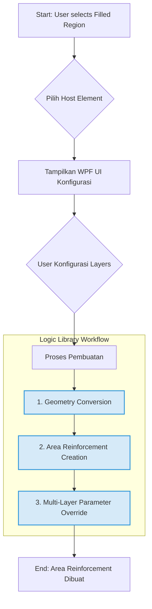

# Multi-Layer Area Reinforcement by Filled Region

## 1. Ringkasan Fungsional

Skrip ini menyediakan antarmuka pengguna (UI) berbasis WPF untuk membuat beberapa lapis `Area Reinforcement` dari `Filled Region` yang dipilih. Terinspirasi dari fungsionalitas canggih pada tools seperti Naviate, skrip ini memungkinkan pengguna untuk mengkonfigurasi setiap lapis tulangan (atas, bawah, longitudinal, transversal) secara detail sebelum pembuatan elemen di Revit.

Workflow utama skrip ini didasarkan pada arsitektur modular yang memanfaatkan **PrasKaaPykit Logic Library**, memastikan konsistensi, reusabilitas, dan kemudahan maintenance.

**Lokasi Skrip:** `PrasKaaPyKit.tab/Rebar.panel/AreaReinforcement.pulldown/Multi Layer Area Reinforcement by Filled Region.pushbutton`

## 2. Alur Kerja Logika (Core Workflow)

Skrip ini mengikuti alur kerja yang terstruktur dan modular, memisahkan setiap tahapan proses menjadi komponen logis yang jelas.



1.  **Seleksi Awal**: Pengguna memilih satu atau lebih `Filled Region` di view aktif.
2.  **Pemilihan Host**: Skrip meminta pengguna untuk memilih host element yang valid (Floor, Foundation, atau Wall Foundation).
3.  **Konfigurasi UI**: Sebuah window WPF ditampilkan, memungkinkan pengguna untuk mendefinisikan setiap lapis tulangan.
4.  **Proses Pembuatan**: Setelah konfigurasi selesai, skrip mengeksekusi tiga langkah utama menggunakan logic library:
    *   **Geometry Conversion** (`LOG-UTIL-REBAR-003`): Boundary dari `Filled Region` diekstrak dan dikonversi menjadi kurva 3D di model space.
    *   **Area Reinforcement Creation** (`LOG-UTIL-REBAR-001`): Skrip membuat satu atau lebih elemen `AreaReinforcement` berdasarkan jumlah lapis yang dikonfigurasi.
    *   **Parameter Override** (`LOG-UTIL-REBAR-002`): Setiap `AreaReinforcement` yang baru dibuat kemudian di-override parameternya sesuai dengan input dari UI (spacing, bar type, direction, dll).

## 3. Analisis UI/UX (Inspirasi dari Naviate)

Desain UI skrip ini terinspirasi dari efisiensi dan kejelasan tools reinforcement profesional seperti Naviate. Berikut adalah pemetaan antara UI Naviate dan implementasi pada skrip ini.


### Komponen Utama UI:

| Komponen UI (Naviate) | Implementasi pada Skrip (MainWindow.xaml) | Keterangan |
| :--- | :--- | :--- |
| **Top/Bottom Reinforcement Sections** | `DataGrid` (`layersDataGrid`) | Menggunakan `DataGrid` untuk mengelola semua lapis (Top/Bottom, Longitudinal/Transversal) dalam satu tabel terpadu. Setiap baris merepresentasikan satu lapis tulangan. |
| **Main Layer Direction** | Kolom `Direction` di `DataGrid` | Pengguna dapat memilih arah utama (Longitudinal/Transversal) untuk setiap lapis. Diimplementasikan sebagai pilihan 'X' atau 'Y'. |
| **Bar Type Selection** | Kolom `Bar Type` di `DataGrid` | Dropdown untuk memilih `RebarBarType` yang tersedia di proyek. |
| **Spacing/Number of Bars** | Kolom `Spacing (mm)` di `DataGrid` | Saat ini, skrip menggunakan `Maximum Spacing` sebagai `Layout Rule`. Input `Spacing` dari pengguna akan di-override setelah elemen dibuat. |
| **Hook At Start/End** | *Fitur Masa Depan* | Belum diimplementasikan. Dapat ditambahkan sebagai kolom baru di `DataGrid` untuk memilih `RebarHookType`. |
| **Overlap** | *Fitur Masa Depan* | Belum diimplementasikan. Membutuhkan logika tambahan untuk kalkulasi panjang overlap. |
| **Settings Preset** | Tombol `Save/Load Template` | Memungkinkan pengguna untuk menyimpan dan memuat konfigurasi lapis tulangan dalam format JSON. |
| **Summary/Preview** | Panel `Summary & Preview` | Menampilkan ringkasan jumlah total lapis, jumlah `AreaReinforcement` yang akan dibuat, dan estimasi offset cover maksimum. |

## 4. Arsitektur & Integrasi Logic Library

Skrip ini dirancang untuk menjadi "logic-thin", di mana sebagian besar operasi kompleks ditangani oleh utility terpusat di dalam **Logic Library**.

### Integrasi Utama:

1.  **`logic-library/active/structural-elements/rebar/geometry_conversion.py`**
    *   **Fungsi**: `convert_filled_region_to_area_reinforcement_geometry()`
    *   **Peran**: Mengambil `FilledRegion` dan `view` sebagai input, lalu mengembalikan daftar `Curve` yang sudah siap pakai dalam koordinat model. Ini mengisolasi semua logika ekstraksi boundary dan transformasi koordinat.

2.  **`logic-library/active/structural-elements/rebar/create_area_reinforcement.py`**
    *   **Fungsi**: `create_area_reinforcement_safe()`
    *   **Peran**: Mengambil kurva, host, dan tipe sebagai input, lalu membuat elemen `AreaReinforcement` di dalam transaction yang aman. Ini menstandarkan proses pembuatan elemen.

3.  **`logic-library/active/structural-elements/rebar/parameter_override.py`**
    *   **Fungsi**: `override_area_reinforcement_parameters()`
    *   **Peran**: Menerima `AreaReinforcement` yang baru dibuat dan sebuah dictionary berisi parameter overrides dari UI. Fungsi ini kemudian menerapkan setiap override, menangani konversi unit dan validasi tipe data secara otomatis.

4.  **`logic-library/active/structural-elements/rebar/parameter_reference.md`**
    *   **ID**: `LOG-UTIL-REBAR-004`
    *   **Peran**: Berfungsi sebagai "kamus" untuk `parameter_override.py`. Semua nama parameter (`Top Major Spacing`, `Layout Rule`, dll.) dan tipe datanya direferensikan dari sini untuk memastikan konsistensi.

## 5. Pemetaan Parameter (UI ke Revit)

Berikut adalah pemetaan langsung dari input di UI ke parameter `AreaReinforcement` di Revit.

| Input UI (DataGrid) | Parameter Revit Target | Tipe Data | Dikelola oleh Logic Library |
| :--- | :--- | :--- | :--- |
| `Position` = "Top" | `Top Major Spacing`, `Top Minor Spacing`, dll. | Double | `parameter_override.py` |
| `Position` = "Bottom" | `Bottom Major Spacing`, `Bottom Minor Spacing`, dll. | Double | `parameter_override.py` |
| `Diameter (mm)` | `Top/Bottom Major/Minor Bar Type` | ElementId | `script.py` (mencari Bar Type yang cocok) |
| `Spacing (mm)` | `Top/Bottom Major/Minor Spacing` | Double | `parameter_override.py` (dengan konversi unit) |
| `Direction` = "X" | `Top/Bottom Major Direction` | Integer (0) | `script.py` (menentukan `major_direction`) |
| `Direction` = "Y" | `Top/Bottom Major Direction` | Integer (1) | `script.py` (menentukan `major_direction`) |
| (Hardcoded) | `Layout Rule` | Integer (3) | `parameter_override.py` |

## 6. Strategi Multi-Element Creation (Layer Grouping)

### Masalah Dasar
Revit Area Reinforcement elements dibatasi maksimal **2 layers per element** (Top/Exterior + Bottom/Interior). Untuk mengakomodasi unlimited layers, kita perlu strategi cerdas dalam membuat multiple elements.

### Solusi: Partition-Based Grouping
```
Strategi: Gunakan parameter "Partition" untuk grouping logical layers

Layer Input User → Area Reinforcement Elements
──────────────────────────────────────────────
Layers 1-2     → Element 1 (Partition: "Layer 1 & 2")
Layers 3-4     → Element 2 (Partition: "Layer 3 & 4")
Layers 5-6     → Element 3 (Partition: "Layer 5 & 6")
Layers 7       → Element 4 (Partition: "Layer 7") - Single layer
```

### Logika Grouping
```python
def group_layers_for_creation(user_layers):
    """
    Group user layers into Area Reinforcement elements (max 2 layers each)

    Args:
        user_layers: List of layer configurations from UI

    Returns:
        List of element groups, each containing max 2 layers
    """
    element_groups = []
    current_group = []

    for i, layer in enumerate(user_layers, 1):
        current_group.append(layer)

        # Create new element every 2 layers
        if len(current_group) == 2:
            partition_name = f"Layer {i-1} & {i}"
            element_groups.append({
                'partition': partition_name,
                'layers': current_group.copy()
            })
            current_group = []

    # Handle remaining layers (odd number)
    if current_group:
        if len(current_group) == 1:
            partition_name = f"Layer {len(user_layers)}"
        else:
            # This shouldn't happen with the logic above, but safety check
            start_layer = len(user_layers) - len(current_group) + 1
            partition_name = f"Layer {start_layer} & {len(user_layers)}"

        element_groups.append({
            'partition': partition_name,
            'layers': current_group
        })

    return element_groups
```

### Position Mapping dalam Element
```
User Position → Area Reinforcement Layer Position
───────────────────────────────────────────────
"Top"    → Top/Exterior layer dalam element
"Bottom" → Bottom/Interior layer dalam element
```

### Implementasi dalam Code
```python
# Example: 5 user layers → 3 Area Reinforcement elements
user_layers = [
    {'position': 'Top', 'diameter': 12, 'spacing': 150, 'direction': 'X'},     # Layer 1
    {'position': 'Bottom', 'diameter': 10, 'spacing': 200, 'direction': 'Y'},  # Layer 2
    {'position': 'Top', 'diameter': 12, 'spacing': 150, 'direction': 'X'},     # Layer 3
    {'position': 'Bottom', 'diameter': 10, 'spacing': 200, 'direction': 'Y'},  # Layer 4
    {'position': 'Top', 'diameter': 16, 'spacing': 250, 'direction': 'X'}      # Layer 5
]

element_groups = group_layers_for_creation(user_layers)
# Result:
# [
#     {'partition': 'Layer 1 & 2', 'layers': [layer1, layer2]},
#     {'partition': 'Layer 3 & 4', 'layers': [layer3, layer4]},
#     {'partition': 'Layer 5', 'layers': [layer5]}
# ]
```

## 7. Rencana Pengembangan & Fitur Masa Depan

Meskipun fungsionalitas dasarnya sudah solid, skrip ini memiliki potensi untuk dikembangkan lebih lanjut agar setara dengan tools komersial.

-   [ ] **Implementasi Multi-Element Creation**: Menggunakan strategi Partition-based grouping untuk unlimited layers
-   [ ] **Implementasi Hooks**: Menambahkan kolom `Hook At Start` dan `Hook At End` di `DataGrid` untuk memilih `RebarHookType`.
-   [ ] **Kalkulasi Overlap**: Menambahkan input untuk `Overlap` dan logika untuk menyesuaikan panjang tulangan.
-   [ ] **Dukungan Multi-Host**: Memungkinkan pemilihan beberapa host element sekaligus.
-   [ ] **Visualisasi Real-time**: Menambahkan preview grafis dari konfigurasi tulangan di dalam window WPF.
-   [ ] **Integrasi Bar Shape**: Memungkinkan pemilihan `RebarShape` untuk tulangan.
-   [ ] **Refinement UI**: Memperbaiki `DataGrid` dropdown binding issues dan meningkatkan UX.

Dokumentasi ini memberikan gambaran lengkap tentang arsitektur, fungsionalitas, dan potensi pengembangan dari skrip "Multi-Layer Area Reinforcement", menjadikannya sebagai salah satu tool paling canggih dalam PrasKaaPykit.