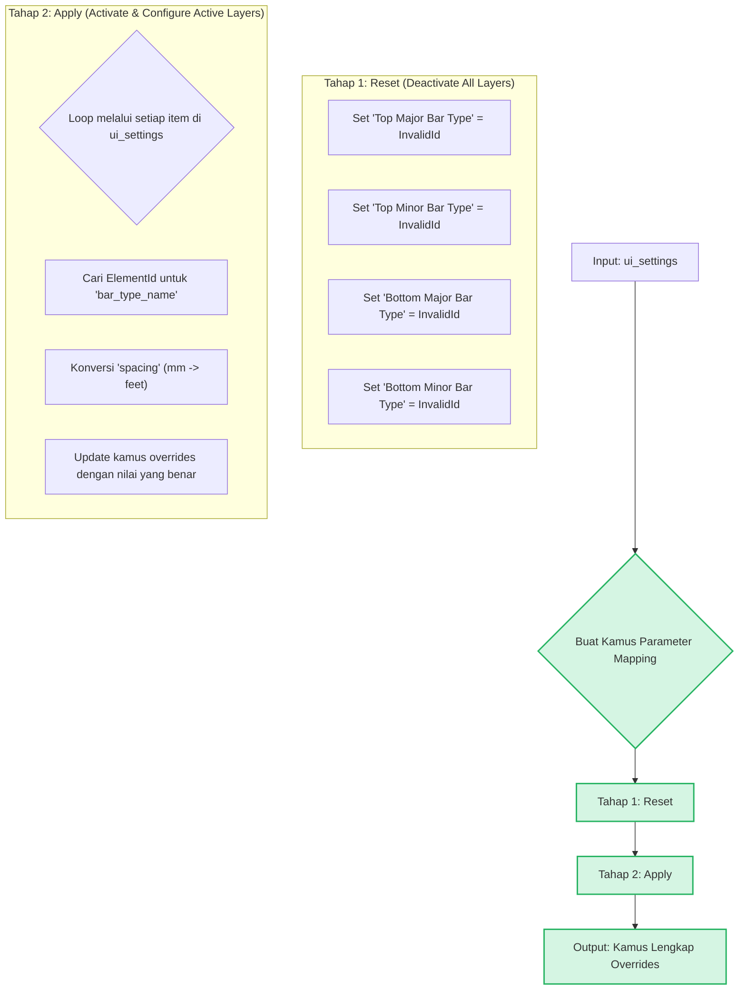

# LOG-UTIL-REBAR-006-v1: Dynamic Area Reinforcement Layout Processor

## 1. Problem Context

Modern reinforcement tools (seperti Naviate) memungkinkan pengguna untuk secara dinamis mengaktifkan atau menonaktifkan lapisan tulangan (misalnya, hanya menggunakan tulangan bawah tanpa tulangan atas). `AreaReinforcement` di Revit tidak memiliki parameter "on/off" sederhana untuk setiap lapisan. Penonaktifan harus dilakukan dengan mengatur parameter `Bar Type` ke nilai null (`ElementId.InvalidElementId`).

Tantangannya adalah bagaimana menerjemahkan input UI yang parsial (misalnya, pengguna hanya mendefinisikan 1 atau 2 dari 4 kemungkinan lapisan) menjadi satu set lengkap parameter override yang secara eksplisit mengaktifkan lapisan yang diinginkan dan menonaktifkan sisanya.

## 2. Solution Summary

Framework ini mendefinisikan sebuah "prosesor layout dinamis" yang mengambil struktur data fleksibel dari input UI dan menghasilkan kamus parameter override yang lengkap untuk `AreaReinforcement`. Prosesor ini secara cerdas mengaktifkan lapisan yang dikonfigurasi dan secara eksplisit menonaktifkan semua lapisan lainnya, meniru perilaku tool canggih.

## 3. Arsitektur & Alur Logika

### 3.1. Struktur Data Input (Dari UI)

Input untuk prosesor ini adalah sebuah list of dictionaries, di mana setiap dictionary merepresentasikan satu lapisan tulangan yang aktif.

```python
# Contoh: Pengguna hanya mengaktifkan Bottom Major dan Top Major
ui_settings = [
    {
        "layer_id": "Bottom Major",      # Kunci identifikasi
        "bar_type_name": "D10",          # Nama RebarBarType
        "spacing": 150,                  # Spasi dalam mm
        "direction": "X"                 # Arah (opsional)
    },
    {
        "layer_id": "Top Major",
        "bar_type_name": "D13",
        "spacing": 200,
        "direction": "X"
    }
]
```

### 3.2. Alur Kerja Prosesor

Prosesor bekerja dalam dua tahap utama: **Reset (Deactivate All)** dan **Apply (Activate & Configure)**.



## 4. Implementasi Kode

### 4.1. Fungsi Prosesor Utama

```python
from logic_library.active.structural_elements.rebar.parameter_reference import LAYOUT_RULES

def process_dynamic_layout_to_overrides(doc, ui_settings):
    """
    Menerjemahkan input UI dinamis menjadi kamus parameter override yang lengkap.

    Args:
        doc (Document): Dokumen Revit aktif.
        ui_settings (list): List of dictionaries yang merepresentasikan lapisan aktif.

    Returns:
        dict: Kamus lengkap parameter override untuk diterapkan.
    """
    # Peta dari layer_id sederhana ke nama parameter Revit yang sebenarnya
    param_map = {
        "Top Major": {"bar_type": "Top Major Bar Type", "spacing": "Top Major Spacing", "direction": "Top Major Direction"},
        "Top Minor": {"bar_type": "Top Minor Bar Type", "spacing": "Top Minor Spacing", "direction": "Top Minor Direction"},
        "Bottom Major": {"bar_type": "Bottom Major Bar Type", "spacing": "Bottom Major Spacing", "direction": "Bottom Major Direction"},
        "Bottom Minor": {"bar_type": "Bottom Minor Bar Type", "spacing": "Bottom Minor Spacing", "direction": "Bottom Minor Direction"},
    }

    # --- TAHAP 1: RESET (NONAKTIFKAN SEMUA LAYER) ---
    overrides = {
        # Set Layout Rule default
        "Layout Rule": LAYOUT_RULES.get("Maximum Spacing", 3)
    }
    for layer_id, params in param_map.items():
        overrides[params["bar_type"]] = ElementId.InvalidElementId

    # --- TAHAP 2: APPLY (AKTIFKAN & KONFIGURASI LAYER DARI UI) ---
    for layer_config in ui_settings:
        layer_id = layer_config.get("layer_id")
        if not layer_id or layer_id not in param_map:
            continue

        # Dapatkan nama parameter yang sesuai
        params = param_map[layer_id]

        # 1. Aktifkan layer dengan mencari Bar Type
        bar_type_name = layer_config.get("bar_type_name")
        bar_type_id = find_rebar_bar_type_by_name(doc, bar_type_name)
        if bar_type_id and bar_type_id != ElementId.InvalidElementId:
            overrides[params["bar_type"]] = bar_type_id
        else:
            # Jika bar type tidak ditemukan, lewati layer ini
            print("Warning: Rebar Bar Type '{}' tidak ditemukan.".format(bar_type_name))
            continue

        # 2. Konfigurasi Spacing
        spacing_mm = layer_config.get("spacing")
        if isinstance(spacing_mm, (int, float)):
            overrides[params["spacing"]] = spacing_mm / 304.8  # Konversi mm ke feet

        # 3. Konfigurasi Direction (Opsional)
        direction = layer_config.get("direction")
        if direction:
            # Arah utama (Major) diatur saat pembuatan AreaReinforcement.
            # Arah minor biasanya tegak lurus.
            # Parameter '... Direction' (0=X, 1=Y) bisa di-set di sini jika perlu.
            pass

    return overrides

def find_rebar_bar_type_by_name(doc, name):
    """Mencari RebarBarType berdasarkan nama dan mengembalikan ElementId-nya."""
    if not name:
        return None
    collector = FilteredElementCollector(doc).OfClass(RebarBarType)
    for bar_type in collector:
        # Pencocokan nama yang tidak case-sensitive
        if bar_type.Name.lower() == name.lower():
            return bar_type.Id
    return None
```

### 4.2. Integrasi dengan Workflow Utama

```python
# Di dalam `main()` function setelah UI ditutup

# 1. Dapatkan ui_settings dari ViewModel (misalnya, dari DataGrid)
ui_settings = wpf_window.get_layer_config_as_dicts() 

# 2. Panggil prosesor untuk mendapatkan kamus overrides
parameter_overrides = process_dynamic_layout_to_overrides(doc, ui_settings)

# 3. Buat Area Reinforcement (hanya satu instance)
# Arah utama bisa diambil dari layer pertama yang didefinisikan
major_direction = XYZ(1, 0, 0) # Default X
if ui_settings and ui_settings[0].get("direction") == "Y":
    major_direction = XYZ(0, 1, 0)

area_reinf = create_area_reinforcement_safe(
    doc, 
    model_curves, 
    host, 
    major_direction=major_direction
)

# 4. Terapkan semua overrides yang sudah diproses
if area_reinf:
    override_area_reinforcement_parameters(area_reinf, parameter_overrides)
```

## 5. Keuntungan Arsitektur Ini

1.  **Fleksibilitas UI**: UI dapat didesain sebebas mungkin (seperti Naviate). Selama outputnya adalah struktur data `ui_settings` yang konsisten, logika backend akan bekerja.
2.  **Logika Terpusat**: Semua aturan tentang cara mengaktifkan/menonaktifkan dan memetakan parameter berada di satu tempat (`process_dynamic_layout_to_overrides`).
3.  **Robust**: Dengan memulai dari keadaan "semua nonaktif", tidak ada risiko ada lapisan sisa dari konfigurasi default yang tidak sengaja aktif.
4.  **Dapat Diperluas**: Mudah untuk menambahkan parameter baru (misalnya, `hooks`, `shapes`) ke dalam `param_map` dan logika pemrosesan tanpa mengubah alur kerja utama.
5.  **Self-Documenting**: Struktur `ui_settings` dan `param_map` sangat mudah dibaca dan dipahami.

## 6. Referensi Parameter Terkait

-   **`LOG-UTIL-REBAR-002`**: Framework ini menjadi implementasi inti dari `override_area_reinforcement_parameters`.
-   **`LOG-UTIL-REBAR-004`**: `param_map` didasarkan pada nama parameter yang didokumentasikan di sini.

Dengan mengadopsi arsitektur ini, skrip Anda akan memiliki kemampuan konfigurasi dinamis yang setara dengan tool komersial, sambil tetap menjaga kode yang bersih dan terstruktur.