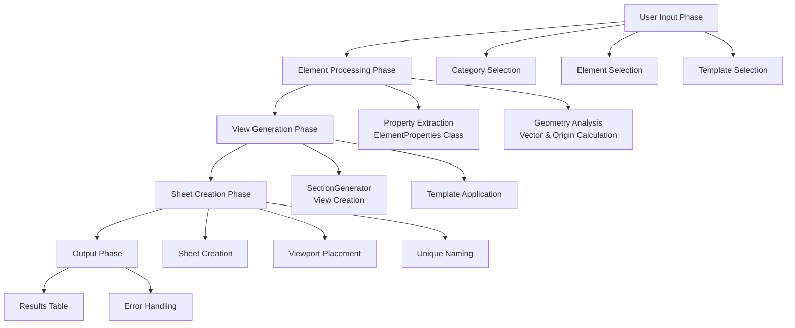

# Element Sections Generator - Detailed Technical Documentation

## Overview
**Element Sections Generator** adalah script pyRevit yang secara otomatis membuat section views (elevation, cross section, plan) untuk elemen-elemen yang dipilih user, kemudian menempatkannya pada sheet baru. Script ini menggunakan algoritma canggih untuk mengekstrak properties geometri dari berbagai tipe elemen Revit.

**Version:** 0.2 (Beta)
**Source:** EF-Tools.extension
**Date:** 31.03.2024
**Author:** Erik Frits

## Architecture & Logic Flow

### Core Logic Structure



## Detailed Component Analysis

### 1. ElementProperties Class - Core Logic

#### Purpose
Kelas ini adalah jantung dari script, bertugas mengekstrak properties geometri dari berbagai tipe elemen Revit dengan cara yang konsisten.

#### Logic Flow per Element Type

#### **Wall Elements (`get_wall_properties`)**
```python
def get_wall_properties(self):
    # 1. Extract wall curve from Location
    wall_curve = self.el.Location.Curve

    # 2. Get endpoints for vector calculation
    pt_start = wall_curve.GetEndPoint(0)
    pt_end = wall_curve.GetEndPoint(1)

    # 3. Calculate direction vector
    self.vector = pt_end - pt_start

    # 4. Calculate width from vector length
    self.width = self.vector.GetLength()

    # 5. Get height from built-in parameter
    self.height = self.el.get_Parameter(BuiltInParameter.WALL_USER_HEIGHT_PARAM).AsDouble()

    # 6. Calculate origin from bounding box center
    BB = self.el.get_BoundingBox(None)
    self.origin = (BB.Max + BB.Min) / 2
```

**Logic Rationale:**
- **Curve-based approach**: Wall selalu memiliki Location.Curve yang memberikan informasi akurat tentang orientasi dan panjang
- **Built-in parameter**: WALL_USER_HEIGHT_PARAM memberikan tinggi wall yang sudah dihitung Revit
- **Bounding box center**: Origin yang reliable untuk positioning section views

#### **Generic Elements (`get_generic_properties`)**

##### **Point-Based Families (OneLevelBased, TwoLevelsBased, WorkPlaneBased)**
```python
# 1. Get bounding boxes
BB = self.el.get_BoundingBox(None)      # Instance bounding box
BB_typ = el_type.get_BoundingBox(None)  # Type bounding box

# 2. Calculate origin from instance BB center
self.origin = (BB.Max + BB.Min) / 2

# 3. Get dimensions from type BB (more reliable)
self.width = (BB_typ.Max.X - BB_typ.Min.X)
self.height = (BB_typ.Max.Z - BB_typ.Min.Z)
self.depth = (BB_typ.Max.Y - BB_typ.Min.Y)

# 4. Calculate base vector from type dimensions
pt_start = XYZ(BB_typ.Min.X, (BB_typ.Min.Y + BB_typ.Max.Y) / 2, BB_typ.Min.Z)
pt_end = XYZ(BB_typ.Max.X, (BB_typ.Min.Y + BB_typ.Max.Y) / 2, BB_typ.Min.Z)
self.vector = pt_end - pt_start

# 5. Apply rotation if element is rotated
try:
    rotation_rad = self.el.Location.Rotation
    self.vector = rotate_vector(self.vector, rotation_rad)
except:
    pass  # No rotation or rotation not applicable
```

**Logic Rationale:**
- **Type vs Instance BB**: Type BB lebih reliable karena tidak terpengaruh oleh instance placement
- **Vector calculation**: Menggunakan titik start/end pada base elevation untuk directional vector
- **Rotation handling**: Apply rotation transformation untuk elemen yang di-rotate

##### **Curve-Based Families (CurveBased, CurveDrivenStructural)**
```python
# 1. Get curve from location
curve = self.el.Location.Curve

# 2. Calculate origin from BB center
self.origin = (BB.Max + BB.Min) / 2

# 3. Get curve endpoints
pt_start = curve.GetEndPoint(0)
pt_end = curve.GetEndPoint(1)

# 4. Normalize Z coordinates (project to horizontal plane)
if pt_start.Z != pt_end.Z:
    pt_start = XYZ(pt_start.X, pt_start.Y, pt_start.Z)
    pt_end = XYZ(pt_end.X, pt_end.Y, pt_start.Z)

# 5. Calculate vector and dimensions
self.vector = pt_end - pt_start
self.width = self.vector.GetLength()
self.height = (BB.Max.Z - BB.Min.Z)
```

**Logic Rationale:**
- **Z-normalization**: Memproyeksikan ke horizontal plane untuk konsistensi
- **Curve endpoints**: Memberikan directional information yang akurat
- **BB height**: Menggunakan Z-range untuk vertical dimension

##### **Hosted Families (OneLevelBasedHosted)**
```python
# 1. Get host element
host = self.el.Host

# 2. Special handling for wall-hosted elements
if type(host) == Wall:
    wall_curve = host.Location.Curve
    pt_start = wall_curve.GetEndPoint(0)
    pt_end = wall_curve.GetEndPoint(1)
    self.vector = pt_end - pt_start

    # 3. Handle facing orientation
    try:
        if self.el.FacingFlipped:
            self.vector = -self.vector
    except:
        pass

# 4. Calculate dimensions from type BB
self.width = (BB_typ.Max.X - BB_typ.Min.X)
self.height = (BB_typ.Max.Z - BB_typ.Min.Z)
self.origin = (BB.Max + BB.Min) / 2
```

**Logic Rationale:**
- **Host-based vector**: Menggunakan host geometry untuk directional information
- **Facing flip handling**: Membalik vector jika elemen facing flipped
- **Type dimensions**: Menggunakan family type untuk size information

### 2. SectionGenerator Class Logic

#### View Creation Algorithm
```python
# SectionGenerator creates 3 views:
# 1. Elevation view (along the vector)
# 2. Cross section view (perpendicular to vector)
# 3. Plan view (top-down)

elev, cross, plan = gen.create_sections(view_name_base=view_name_base)
```

**Algorithm Logic:**
1. **Elevation View**: Section plane sejajar dengan vector elemen
2. **Cross Section**: Section plane tegak lurus dengan vector
3. **Plan View**: Section plane horizontal dari atas

#### Parameter Usage
- **origin**: Titik pusat untuk section plane
- **vector**: Arah utama elemen (menentukan orientasi elevation)
- **width**: Lebar view crop region
- **height**: Tinggi view crop region
- **offset**: Jarak section plane dari origin
- **depth**: Kedalaman view (untuk 3D cropping)
- **depth_offset**: Offset untuk depth cropping

### 3. Selection Filter Logic

#### EF_SelectionFilter Class
```python
class EF_SelectionFilter(ISelectionFilter):
    def __init__(self, list_types_or_cats):
        # Convert BuiltInCategories to ElementIds
        self.list_types_or_cats = [
            ElementId(i) if type(i) == BuiltInCategory else i
            for i in list_types_or_cats
        ]

    def AllowElement(self, element):
        # Exclude view-specific elements
        if element.ViewSpecific:
            return False

        # Check element type
        if type(element) in self.list_types_or_cats:
            return True

        # Check element category
        elif element.Category.Id in self.list_types_or_cats:
            return True
```

**Logic Rationale:**
- **Dual filtering**: Support untuk filtering berdasarkan .NET type atau BuiltInCategory
- **View-specific exclusion**: Mencegah selection elemen yang hanya ada di view tertentu
- **ElementId conversion**: Konsistensi dalam perbandingan

### 4. Sheet Creation & View Placement Logic

#### place_views_on_sheet Function
```python
def place_views_on_sheet(doc, views, new_sheet):
    positions = [
        XYZ(-0.85, 0.65, 0),  # Position 1
        XYZ(-0.5, 0.65, 0),   # Position 2
        XYZ(-0.85, 0.35, 0)   # Position 3
    ]

    for n, view in enumerate(views):
        if Viewport.CanAddViewToSheet(doc, new_sheet.Id, view.Id):
            pt = positions[n]
            viewport = Viewport.Create(doc, new_sheet.Id, view.Id, pt)
```

**Logic Rationale:**
- **Hardcoded positions**: Layout yang konsisten untuk 3 views
- **Viewport validation**: Cek apakah view bisa ditambahkan ke sheet
- **Coordinate system**: Menggunakan sheet coordinate system (feet)

#### Unique Naming Algorithm
```python
sheet_number = 'EF_{}_{}'.format(type_name, el.Id)

# Ensure unique sheet number
for i in range(10):
    try:
        new_sheet.SheetNumber = sheet_number
        new_sheet.Name = sheet_name
        break
    except:
        sheet_number += '*'  # Add asterisk if duplicate
```

**Logic Rationale:**
- **Element ID inclusion**: Memastikan uniqueness
- **Incremental suffix**: Menambah * jika ada konflik nama
- **Type-based naming**: Menggunakan element type untuk identifikasi

### 5. Progress & Error Handling Logic

#### Progress Bar Implementation
```python
counter = 0
max_value = len(selected_elems)
with ProgressBar(cancellable=True) as pb:
    for el in selected_elems:
        if pb.cancelled:
            break

        counter += 1
        pb.update_progress(counter, max_value)

        try:
            # Process element
            pass
        except:
            # Error handling with debug mode
            if EXEC_PARAMS.debug_mode:
                print(traceback.format_exc())
```

**Logic Rationale:**
- **Cancellable progress**: User bisa cancel operasi
- **Debug mode**: Detailed error reporting saat development
- **Silent failure**: Production mode tidak menampilkan error details

## Key Algorithms & Patterns

### 1. **Bounding Box Center Calculation**
```python
origin = (BB.Max + BB.Min) / 2
```
**Purpose**: Calculate geometric center untuk positioning section views

### 2. **Vector Normalization**
```python
if pt_start.Z != pt_end.Z:
    pt_end = XYZ(pt_end.X, pt_end.Y, pt_start.Z)
```
**Purpose**: Project vectors ke horizontal plane untuk konsistensi

### 3. **Rotation Transformation**
```python
vector = rotate_vector(self.vector, rotation_rad)
```
**Purpose**: Apply element rotation ke directional vector

### 4. **Family Placement Type Detection**
```python
el_placement = el_fam.FamilyPlacementType
if el_placement in [fpt.OneLevelBased, fpt.TwoLevelsBased, fpt.WorkPlaneBased]:
    # Point-based logic
elif el_placement in [fpt.CurveBased, fpt.CurveDrivenStructural]:
    # Curve-based logic
```
**Purpose**: Different extraction logic berdasarkan family placement type

## Customization Opportunities

### 1. **Add New Element Types**
```python
elif el.Category.Id == ElementId(BuiltInCategory.OST_Stairs):
    self.get_stair_properties()
```

### 2. **Custom View Types**
```python
# Add isometric view
iso_view = gen.create_isometric_view()

# Add detail views
detail_views = gen.create_detail_views(specific_regions)
```

### 3. **Parameter-Based Filtering**
```python
# Integrate with logic-library parameter extraction
if extract_parameter_by_name(el, "Custom_Parameter") == "Target_Value":
    # Process only elements with specific parameter value
```

### 4. **Dynamic Sheet Layout**
```python
# Instead of hardcoded positions
positions = calculate_optimal_layout(num_views, sheet_size)
```

### 5. **Advanced Naming Convention**
```python
# Include parameter values in names
param_value = extract_parameter_by_name(el, "Mark")
view_name = f"{type_name}_{param_value}_{el.Id}"
```

## Performance Considerations

### **Efficient Operations**
- Single pass element processing
- Minimal API calls per element
- Batch view creation

### **Memory Management**
- No large data structures retained
- Element references released after processing
- Transaction scope limited

### **Error Resilience**
- Try-catch blocks around critical operations
- Continue processing on individual failures
- Debug mode for detailed error reporting

## Integration Points

### **With Logic Library**
- Parameter extraction untuk filtering
- Shared parameter access untuk naming
- Type classification untuk processing logic

### **With Custom Utilities**
- Vector rotation functions
- View template management
- Sheet layout algorithms

### **With UI Components**
- Custom selection dialogs
- Progress indicators
- Result display tables

## Future Enhancement Possibilities

1. **Machine Learning Integration**: Automatic view type detection
2. **Template Matching**: AI-based optimal view positioning
3. **Collaborative Features**: Multi-user view coordination
4. **Cloud Integration**: BIM 360 view publishing
5. **Advanced Analytics**: View usage tracking and optimization

---

*This documentation provides comprehensive understanding of the Element Sections Generator script logic, enabling effective customization and extension for specific project requirements.*

## Source Code Location
**Original Source:** `../EF-Tools.extension/EF_Tools.tab/Views.panel/Column2.stack/SectionsGenerator.pulldown/SectionsGenerator.pushbutton/script.py`

## Dependencies
- `Snippets._vectors.rotate_vector`
- `Snippets._views.SectionGenerator`
- `GUI.forms.select_from_dict`

## File Structure
```
logic-library/sources/Element Section Generator by EF/
├── README.md (this file)
└── [additional analysis files if needed]