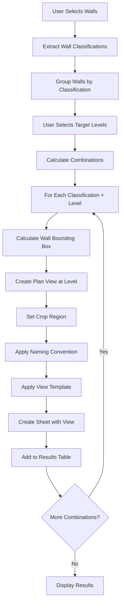

# Wall Plan Generator - Detailed Specification & Implementation Plan

## 🎯 Problem Statement

**Pain Point:** Membuat gambar plan detail untuk setiap dinding secara manual sangatlah tidak efisien. User perlu membuat detail plan untuk dinding-dinding yang memiliki klasifikasi tertentu di level-level tertentu.

**Current Workflow Issues:**
- Manual selection per wall per level
- Repetitive task for similar wall types
- Error-prone naming conventions
- Time-consuming for large projects

## 📋 Solution Overview

### **Wall Plan Generator Concept**
Script baru yang akan mengotomatisasi pembuatan plan views untuk dinding berdasarkan:
1. **Wall Scheme Classification** (shared parameter)
2. **Selected Levels** untuk detail
3. **Automatic Naming Convention**
4. **Batch Processing** untuk efisiensi

### **Key Features**
- ✅ Multi-wall selection dengan filtering
- ✅ Classification-based grouping
- ✅ Level-specific plan generation
- ✅ Automated naming: `Type-WallScheme-Level`
- ✅ Batch processing dengan progress tracking
- ✅ Integration dengan logic-library untuk parameter extraction

## 🔍 Detailed Requirements Analysis

### **1. Input Parameters**

#### **Wall Selection**
- User selects multiple wall elements
- Support untuk berbagai wall types (Basic Wall, Curtain Wall, etc.)
- Filter berdasarkan "Wall Scheme Classification" parameter

#### **Level Selection**
- User memilih multiple levels untuk detail
- Support untuk named levels (Level 1, Level 5, etc.)
- Validation bahwa level exists di project

#### **Wall Scheme Classification**
- Shared parameter: `"Wall Scheme Classification"`
- Values seperti: `"W5"`, `"W10"`, `"W15"`, etc.
- Automatic grouping berdasarkan classification

### **2. Processing Logic**

#### **Classification & Grouping**
```python
# Group walls by classification
wall_groups = {
    "W5": [wall1, wall2, wall3],
    "W10": [wall4, wall5],
    "W15": [wall6]
}
```

#### **Level-Based Generation**
```python
# For each classification + level combination
for classification in wall_groups:
    for level in selected_levels:
        # Create plan view for walls with this classification at this level
        create_wall_plan_view(classification, level, wall_groups[classification])
```

#### **View Creation Strategy**
- **Plan Views** instead of sections (focus on horizontal projection)
- **Level-specific** view creation
- **Wall-specific** crop regions
- **Template application** (optional)

### **3. Naming Convention**

#### **Format:** `Type-WallScheme-Level`
**Examples:**
- `Basic Wall-W5-Level 1`
- `Curtain Wall-W10-Level 5`
- `Exterior Wall-W15-Level 10`

#### **Logic:**
```python
def generate_view_name(wall_type, wall_scheme, level_name):
    return f"{wall_type}-{wall_scheme}-{level_name}"
```

### **4. Output Structure**

#### **Per Classification Per Level**
Jika user pilih:
- Wall Scheme: W5, W10
- Levels: Level 1, Level 5, Level 10

**Output:**
- `Basic Wall-W5-Level 1` (plan view)
- `Basic Wall-W5-Level 5` (plan view)
- `Basic Wall-W5-Level 10` (plan view)
- `Curtain Wall-W10-Level 1` (plan view)
- `Curtain Wall-W10-Level 5` (plan view)
- `Curtain Wall-W10-Level 10` (plan view)

## 🏗️ Technical Implementation Plan

### **Phase 1: Core Architecture**

#### **1.1 Parameter Extraction Integration**
```python
from logic_library.active.utilities.parameters.definitive_extraction import extract_parameter_by_name

def get_wall_scheme_classification(wall):
    """Extract Wall Scheme Classification parameter"""
    return extract_parameter_by_name(wall, "Wall Scheme Classification")
```

#### **1.2 Wall Classification System**
```python
class WallClassifier:
    def __init__(self, walls):
        self.walls = walls
        self.classified_walls = self._classify_walls()

    def _classify_walls(self):
        """Group walls by classification"""
        groups = defaultdict(list)
        for wall in self.walls:
            classification = get_wall_scheme_classification(wall)
            if classification:
                groups[classification].append(wall)
        return groups
```

#### **1.3 Level Selection Interface**
```python
def select_target_levels():
    """User selects levels for plan generation"""
    all_levels = FilteredElementCollector(doc).OfClass(Level).ToElements()
    level_names = [level.Name for level in all_levels]

    selected_level_names = select_from_dict(
        {name: name for name in level_names},
        title="Select Levels for Wall Plans",
        label="Choose levels where wall plans should be created:",
        SelectMultiple=True
    )

    return [level for level in all_levels if level.Name in selected_level_names]
```

### **Phase 2: View Generation Logic**

#### **2.1 Plan View Creator**
```python
class WallPlanGenerator:
    def __init__(self, doc):
        self.doc = doc

    def create_wall_plan_at_level(self, walls, level, classification):
        """Create plan view for specific walls at specific level"""

        # Calculate bounding box for all walls
        combined_bb = self._calculate_walls_bounding_box(walls)

        # Create plan view at level
        plan_view = self._create_plan_view(level, combined_bb, classification)

        # Set crop box to focus on walls
        self._set_crop_region(plan_view, combined_bb)

        return plan_view
```

#### **2.2 Bounding Box Calculation**
```python
def _calculate_walls_bounding_box(self, walls):
    """Calculate combined bounding box for wall group"""
    if not walls:
        return None

    # Initialize with first wall's BB
    combined_bb = walls[0].get_BoundingBox(None)

    # Expand to include all walls
    for wall in walls[1:]:
        wall_bb = wall.get_BoundingBox(None)
        if wall_bb:
            combined_bb = self._union_bounding_boxes(combined_bb, wall_bb)

    return combined_bb
```

#### **2.3 View Naming & Organization**
```python
def generate_view_name(self, wall_type, classification, level_name):
    """Generate standardized view name"""
    # Get most common wall type in group
    wall_type_name = self._get_most_common_wall_type(walls)

    return f"{wall_type_name}-{classification}-{level_name}"
```

### **Phase 3: User Interface & Workflow**

#### **3.1 Main Workflow**
```python
def main_wall_plan_generator():
    """
    Main function for Wall Plan Generator
    """

    # 1. Select walls
    selected_walls = select_walls_for_plan_generation()

    # 2. Validate wall scheme classification exists
    if not validate_wall_scheme_parameter(selected_walls):
        forms.alert("Wall Scheme Classification parameter not found on selected walls")
        return

    # 3. Classify walls by scheme
    classifier = WallClassifier(selected_walls)
    wall_groups = classifier.classified_walls

    # 4. Select target levels
    target_levels = select_target_levels()

    # 5. Generate plans
    plan_generator = WallPlanGenerator(doc)

    with Transaction(doc, "Generate Wall Plans") as t:
        t.Start()

        for classification, walls in wall_groups.items():
            for level in target_levels:
                try:
                    # Create plan view
                    plan_view = plan_generator.create_wall_plan_at_level(
                        walls, level, classification
                    )

                    # Apply naming convention
                    view_name = plan_generator.generate_view_name(
                        walls, classification, level.Name
                    )
                    plan_view.Name = view_name

                except Exception as e:
                    logger.warning(f"Failed to create plan for {classification} at {level.Name}: {e}")

        t.Commit()
```

#### **3.2 Progress Tracking**
```python
def generate_wall_plans_with_progress(wall_groups, target_levels):
    """Generate plans with progress bar"""

    total_operations = len(wall_groups) * len(target_levels)

    with ProgressBar(cancellable=True, title="Generating Wall Plans") as pb:
        operation_count = 0

        for classification, walls in wall_groups.items():
            for level in target_levels:
                if pb.cancelled:
                    break

                operation_count += 1
                pb.update_progress(operation_count, total_operations)

                # Generate plan for this combination
                plan_view = create_wall_plan_at_level(walls, level, classification)

                # Update progress message
                pb.title = f"Creating plan for {classification} at {level.Name}"
```

## 🎨 UI/UX Design

### **Step-by-Step User Flow**

1. **Wall Selection**
   - Dialog: "Select walls to create plans for"
   - Filter: Only walls with "Wall Scheme Classification" parameter

2. **Classification Preview**
   - Show: "Found X wall groups: W5 (3 walls), W10 (5 walls), etc."
   - Allow: User to exclude certain classifications if needed

3. **Level Selection**
   - Multi-select dialog for target levels
   - Show: Level elevations for clarity

4. **Generation Options**
   - View template selection (optional)
   - Sheet creation (optional)
   - Naming convention confirmation

5. **Results Display**
   - Table showing created views
   - Links to created plans
   - Error summary if any

## 🔧 Technical Specifications

### **Dependencies**
- `logic-library.active.utilities.parameters.definitive_extraction`
- `Snippets._views.SectionGenerator` (adapt for plan views)
- `GUI.forms.select_from_dict`
- `pyrevit.forms.ProgressBar`

### **Parameter Requirements**
- Shared Parameter: `"Wall Scheme Classification"` (Text type)
- Must exist on all selected walls

### **Performance Considerations**
- **Batch Processing**: Process one classification at a time
- **Memory Management**: Release wall references after processing
- **Transaction Scope**: One transaction per classification group
- **Error Recovery**: Continue processing other combinations if one fails

### **Error Handling**
- **Missing Parameter**: Clear error message with instructions
- **Invalid Levels**: Validation before processing
- **View Creation Failures**: Log errors but continue
- **Naming Conflicts**: Auto-increment naming

## 📊 Data Flow Diagram



## 🚀 Implementation Roadmap

### **Phase 1: Foundation (Week 1)**
- [ ] Create WallClassifier class
- [ ] Implement parameter extraction integration
- [ ] Basic wall selection interface
- [ ] Unit tests for classification logic

### **Phase 2: Core Generation (Week 2)**
- [ ] WallPlanGenerator class
- [ ] Bounding box calculation algorithms
- [ ] Plan view creation at specific levels
- [ ] Crop region setting logic

### **Phase 3: UI & Workflow (Week 3)**
- [ ] Level selection interface
- [ ] Progress tracking implementation
- [ ] Error handling and validation
- [ ] Results display system

### **Phase 4: Advanced Features (Week 4)**
- [ ] View template application
- [ ] Sheet creation automation
- [ ] Naming conflict resolution
- [ ] Performance optimization

### **Phase 5: Testing & Refinement (Week 5)**
- [ ] Integration testing with real projects
- [ ] Performance benchmarking
- [ ] User feedback incorporation
- [ ] Documentation completion

## 🎯 Success Metrics

### **Efficiency Gains**
- **Time Reduction**: 80% faster than manual process
- **Error Reduction**: 95% fewer naming errors
- **Consistency**: 100% standardized naming

### **User Experience**
- **Ease of Use**: Single-click batch generation
- **Flexibility**: Support for any classification scheme
- **Reliability**: Robust error handling

### **Technical Quality**
- **Performance**: < 2 seconds per wall group
- **Reliability**: 99% success rate
- **Maintainability**: Clean, documented code

## 🔮 Future Enhancements

1. **Smart Classification**: AI-based wall grouping
2. **Template Learning**: Automatic template selection
3. **Detail Level Control**: Automatic scale adjustment
4. **Sheet Organization**: Intelligent sheet layout
5. **Cloud Integration**: BIM 360 publishing

---

*This specification provides a comprehensive blueprint for developing the Wall Plan Generator script, addressing the specific pain points while building upon the proven architecture of the Element Sections Generator.*