# Wall Plan Generator - Complete Workflow Diagram

## 🎯 High-Level Process Flow


## 🔍 Detailed Component Workflow

### **1. Wall Selection & Validation Phase**


### **2. Classification Extraction Phase**


### **3. Level Selection Phase**


### **4. Plan Generation Core Logic**


### **5. Mid-Height Calculation Algorithm**


### **6. Bounding Box Calculation Algorithm**


### **7. Results Processing & Display**

```mermaid
graph TD
    A[Receive Generation Results] --> B[Initialize Output Display]
    B --> C[Calculate Statistics<br/>Success/Failed Counts]
    C --> D[Create Table Data Structure]
    D --> E[For Each Result]
    E --> F[Format Status Icon<br/>✅ Success / ❌ Failed]
    F --> G[Create View Link<br/>if view exists]
    G --> H[Add Row to Table<br/>Classification, Level, Count, Status, Link]
    H --> I{More Results?}
    I -->|Yes| E
    I -->|No| J[Display Summary Header<br/>Total Success/Failed]
    J --> K[Display Results Table<br/>with Interactive Links]
    K --> L[End Display Process]
```



## 🔄 Error Handling Flow


## 📊 Data Flow Architecture


## 🎨 User Experience Flow

```mermaid
graph TD
    A[User Clicks Tool] --> B[Wall Selection Dialog<br/>'Select walls and click Finish']
    B --> C[Processing Indicator<br/>'Extracting classifications...']
    C --> D[Classification Summary<br/>'Found 3 groups: W5(5), W10(3), W15(7)']
    D --> E[Level Selection Dialog<br/>Multi-select with elevations]
    E --> F[Confirmation Dialog<br/>'Generate 9 plan views?']
    F --> G[Progress Bar<br/>'Creating plan for W5 at Level 1...']
    G --> H[Results Table<br/>Interactive view links]
    H --> I[Completion Message<br/>'9 views created successfully']
```

## 🔧 Technical Component Interactions


---

*This comprehensive workflow diagram shows the complete Wall Plan Generator process from user interaction to final results display, including error handling and data flow architecture.*