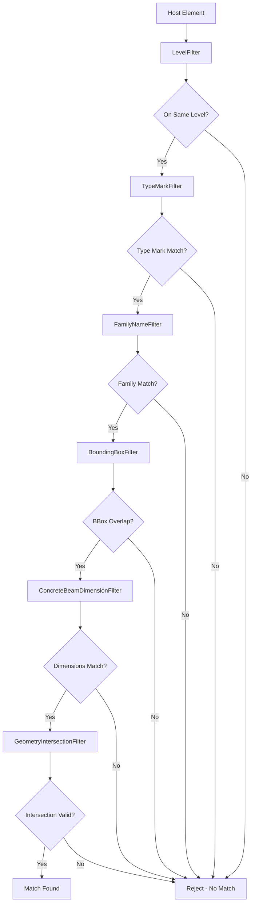

# Geometry Matching Modular Filter Plan

## Overview

This document outlines the plan for implementing a modular filtering system for geometry matching between linked models and host models in the PrasKaaPyKit extension.

---

## 1. Git Branch Information

- **Branch Name**: `feature/geometry-matching-modular-filter`
- **Status**: ✅ Created
- **Purpose**: Development of modular geometry matching filter system

---

## 2. Current Existing Libraries

### 2.1 lib/geometry_matching.py
Contains:
- `get_solid(element, options)` - Extract solid geometry
- `get_beam_dimensions(beam)` - Extract beam dimensions (b, h)
- `compare_dimensions()` - Compare beam dimensions
- `extract_type_mark_from_type_name()` - **NOTE: Used specifically for ETABS comparison**
- `match_beams()` - Main matching function
- `collect_beams()` - Collect beam elements
- `create_geometry_options()` - Create geometry options

### 2.2 lib/linked_elements.py
Contains:
- `get_all_revti_link_instances(doc)` - Get all link instances
- `get_linked_document(link_instance)` - Get linked document
- `LinkedElementInfo` class - Container for linked element data
- Tag checking utilities

### 2.3 lib/linked_model_utils.py
Contains:
- `select_linked_model(doc)` - UI for selecting linked model
- `get_linked_beams(link_doc)` - Get beams from linked doc
- `get_linked_columns(link_doc)` - Get columns from linked doc
- `validate_linked_model()` - Validate linked model

### 2.4 lib/Snippets/
- `_boundingbox.py` - `is_point_in_BB_2D()` function
- `smart_selection.py` - Smart selection utilities

---

## 3. Filter Modules to Implement

### 3.1 Filter Architecture

Each filter will follow the Chain of Responsibility pattern with:
- Base class with abstract `filter()` method
- Statistics tracking (processed, passed, rejected)
- Enable/disable capability
- Configurable parameters

### 3.2 Filter List

| # | Filter Name | Purpose | Complexity | Reuse From |
|---|-------------|---------|------------|------------|
| 1 | `LevelFilter` | Match elements on same level | Cheap | `geometry_matching.py` |
| 2 | `ConcreteBeamDimensionFilter` | Match concrete beam dimensions (b, h) | Cheap | `geometry_matching.py` |
| 3 | `ETABSTypeMarkFilter` | Match Type Mark for ETABS comparison | Cheap | `geometry_matching.py` - `extract_type_mark_from_type_name()` |
| 4 | `RevitTypeMarkFilter` | Match Type Mark between two Revit elements | Cheap | **NEW - for host vs linked comparison** |
| 5 | `FamilyNameFilter` | Match Family Name | Cheap | element properties |
| 6 | `BoundingBoxFilter` | Spatial proximity check | Moderate | `Snippets/_boundingbox.py` |
| 7 | `GeometryIntersectionFilter` | Boolean intersection validation | Expensive | `geometry_matching.py` |

---

## 4. New Libraries Required

### 4.1 Type Mark Comparison Library

**Location**: `lib/geometry_matching.py` (extension) or new file

**Reason**: The existing `extract_type_mark_from_type_name()` in `geometry_matching.py` is specifically designed for comparing Type Marks between **ETABS exported Revit model** and **ETABS source**. We need a **separate comparison logic** for comparing Type Marks between **two Revit elements** (host vs linked).

**Required Functions**:
```python
def compare_type_marks(host_type_mark, linked_type_mark, exact_match=False):
    """
    Compare Type Marks between two Revit elements.
    
    Args:
        host_type_mark: Type Mark from host element
        linked_type_mark: Type Mark from linked element  
        exact_match: Require exact match vs prefix match
    
    Returns:
        bool: True if matching
    """

def extract_type_mark_from_element(element):
    """
    Extract Type Mark from a Revit element.
    
    Args:
        element: Revit element
    
    Returns:
        str: Type Mark value or None
    """

def compare_type_names(host_type_name, linked_type_name, use_prefix=True):
    """
    Compare Type Names with optional prefix matching.
    
    Args:
        host_type_name: Type Name from host element
        linked_type_name: Type Name from linked element
        use_prefix: Use prefix extraction
    
    Returns:
        bool: True if matching
    """
```

### 4.2 Concrete Beam Dimension Filter

**Note**: The dimension filter is specifically named `ConcreteBeamDimensionFilter` because:
- Concrete beams have `b` (width) and `h` (depth) parameters
- Steel beams may have different parameter structures
- Future expansion may include `SteelBeamDimensionFilter`

---

## 5. Implementation Order

### Phase 1: Foundation
1. Create filter base classes in `lib/geometry_matching.py`
2. Implement `FilterPipeline` orchestrator
3. Implement basic data extraction utilities

### Phase 2: Basic Filters
4. `LevelFilter` - Simple level ID comparison
5. `ConcreteBeamDimensionFilter` - Concrete beam dimension matching
6. `FamilyNameFilter` - Family name matching

### Phase 3: Advanced Filters
7. `TypeMarkFilter` - Type Mark matching (NEW LIB)
8. `BoundingBoxFilter` - Spatial proximity
9. `GeometryIntersectionFilter` - Boolean intersection

### Phase 4: Testing & Integration
10. Create test pushbutton in `WIP.pulldown`
11. Test with real models
12. Performance optimization

---

## 6. Filter Pipeline Configuration

### Configuration Pattern: WPF UI (Same as Export PDF/DWG)

**Reference**: Uses the same pattern as `SheetsDWG.pushbutton` and `SheetsPDF.pushbutton`

**Implementation:**
- **Normal Click** → Run geometry matching with filter pipeline
- **Shift+Click** → Open WPF dialog for filter configuration

### WPF UI Features Required:

#### 6.1 Drag & Drop Reorder
- Ability to reorder filters via drag & drop
- Shows filter execution order
- Visual feedback during drag

#### 6.2 Toggle Switches
- Each filter has an ON/OFF toggle switch
- Clear visual indication of enabled/disabled state
- When disabled, filter is skipped in pipeline

#### 6.3 Save/Load Presets
- Save current configuration as named preset
- Load saved presets from file
- Built-in default presets:
  - "Default" - Balanced matching
  - "ETABS Mode" - For ETABS comparison
  - "Fast" - Quick matching (skip expensive filters)
  - "Aggressive" - Strict matching

#### 6.4 Parameter Sliders
**NOTE**: Sliders are only needed for **BoundingBoxFilter**. Other filters use toggle switches only.

- **BoundingBoxFilter**: Buffer slider (0.1m - 5m)
- Other filters: Toggle ON/OFF only, no numeric parameters in UI

#### 6.5 Visual Hierarchy
```
┌─────────────────────────────────────────────────────────┐
│  🔧 Geometry Matching Filter Configuration            │
├─────────────────────────────────────────────────────────┤
│  📁 Presets: [Default ▼] [💾 Save] [📂 Load]          │
├─────────────────────────────────────────────────────────┤
│                                                         │
│  📦 LEVEL FILTER                          [═══○═══] ON │
│     └─ Same level as host element                     │
│                                                         │
│  📦 CONCRETE BEAM DIM FILTER           [═══○═══] ON │
│     └─ Tolerance: [────●────────] 1.0 mm             │
│                                                         │
│  📦 ETABS TYPE MARK FILTER            [═══○═══] ON │
│     └─ Use prefix matching                              │
│                                                         │
│  📦 REVIT TYPE MARK FILTER          [═══○═══] ON │
│     └─ ☑ Exact match  ☑ Prefix match                │
│                                                         │
│  📦 FAMILY NAME FILTER               [═══○═══] ON │
│     └─ ☑ Exact match  ☑ Partial match               │
│                                                         │
│  📦 BOUNDING BOX FILTER              [────●────] ON │
│     └─ Buffer: [────●────────────] 1.5 m           │
│                                                         │
│  📦 GEOMETRY INTERSECTION            [────●────] ON │
│     └─ Min Volume: [●─────────────] 1e-9 ft³       │
│     └─ Min Overlap: [●─────────────] 1%            │
│                                                         │
├─────────────────────────────────────────────────────────┤
│  [📋 Copy Config] [📋 Paste Config]    [Cancel] [OK]│
└─────────────────────────────────────────────────────────┘
```

### Config Storage:
- JSON file for presets (e.g., `geometry_matching_presets.json`)
- Saved in: `%APPDATA%/PrasKaaPyKit/` or project folder

### Unit Conversion Library:
**Required**: New functions in `lib/units.py` or new `lib/unit_converter.py`

**NOTE**: `lib/units.py` already exists and contains:
- `convert_length_to_internal(value, doc)` - Convert to internal feet
- `convert_length_to_display(value, doc)` - Convert from internal to display
- `convert_display_string_to_internal(value_string, doc)` - Parse display string to internal
- `is_metric(doc)` - Check if document uses metric

**Additional functions needed** for the slider UI:
- `mm_to_feet(mm)` - Simple mm to feet conversion
- `m_to_feet(m)` - Simple m to feet conversion
- `feet_to_mm(feet)` - Simple feet to mm conversion
- `feet_to_m(feet)` - Simple feet to m conversion

---

## 7. Test Pushbutton Location

**Location**: `PrasKaaPyKit.tab/Rebar.panel/WIP.pulldown/GeometryMatchingTest.pushbutton/`

**Features**:
- Select linked model
- Select host elements (from selection)
- Display filter configuration
- Run matching with modular filters
- Show results and statistics

---

## 8. Future Extensions

Potential future filter types:
- `SteelBeamDimensionFilter` - For steel beams
- `WallDimensionFilter` - For walls
- `ColumnDimensionFilter` - For columns
- `RotationFilter` - Match element rotation/orientation
- `MaterialFilter` - Match material assignments
- `PhaseFilter` - Match phase created/modified

---

## 9. Mermaid Diagram - Filter Flow



---

## 10. Summary

| Item | Status | Notes |
|------|--------|-------|
| Git Branch | ✅ Done | `feature/geometry-matching-modular-filter` |
| Filter Base Classes | ⏳ Pending | In `lib/geometry_matching.py` |
| TypeMarkFilter Lib | ⏳ Pending | ETABS + Revit variants |
| ConcreteBeamDimensionFilter | ⏳ Pending | Using existing dimension extraction |
| WPF Config UI | ⏳ Pending | Shift+Click for configuration |
| Test Pushbutton | ⏳ Pending | In `WIP.pulldown` |

---

**Plan Created**: 2026-02-13
**Last Updated**: 2026-02-13
