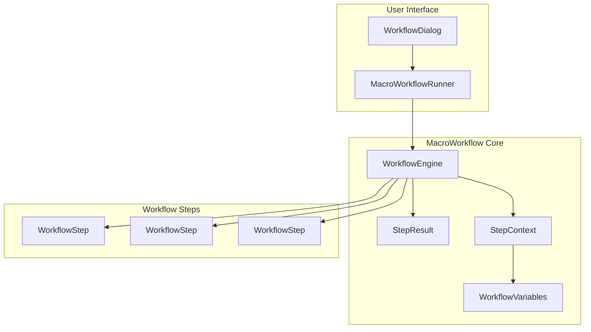

# SPEC.md - pyRevit Macro Workflow Automation System

## Project Overview

**Project Name:** MacroWorkflow  
**Type:** pyRevit Automation Framework  
**Core Functionality:** A macro-like system that automates sequential pyRevit/Revit API operations with proper multi-transaction management  
**Target Users:** BIM Managers, Revit Power Users, Automation Developers

---

## Problem Statement

The user needs to copy detail elements from a source view in one Revit document to a target view in another document. This requires:

1. **Multi-document operations**: Working with two open Revit documents simultaneously
2. **Sequential steps with transaction control**: Each step must complete and commit before proceeding
3. **Specific workflow pattern**:
   - Step 1: Select source and target documents
   - Step 2: Find matching views by name
   - Step 3: Select detail elements in source view
   - Step 4: Change target view display to wireframe (MUST commit transaction before paste)
   - Step 5: Paste elements to target view
   - Step 6: Final commit

The key challenge is managing multiple transactions across different documents with proper commit/rollback handling between sequential operations.

---

## Architecture Overview

### Core Components



### Class Structure

1. **StepResult** - Encapsulates the result of each workflow step execution
2. **StepContext** - Shared context/data between workflow steps
3. **WorkflowVariables** - Key-value store for workflow state
4. **WorkflowStep** - Base class for individual workflow operations
5. **WorkflowEngine** - Orchestrates sequential step execution with transaction management
6. **MacroWorkflowRunner** - UI and execution entry point

---

## Functionality Specification

### 1. StepResult Class

```python
class StepResult:
    """Result of a workflow step execution"""
    
    # Status enum
    class Status:
        SUCCESS = "success"
        FAILED = "failed"
        SKIPPED = "skipped"
        CANCELLED = "cancelled"
    
    # Attributes
    status: Status           # Execution status
    message: str            # Human-readable message
    data: dict              # Step-specific data output
    error: Exception        # Exception object if failed
    transaction_committed: bool  # Whether transaction was committed
    
    # Methods
    def is_success() -> bool
    def is_failed() -> bool
    def get_data(key, default=None) -> any
```

### 2. StepContext Class

```python
class StepContext:
    """Shared context passed between workflow steps"""
    
    # Attributes
    source_doc: Document     # Source Revit document
    target_doc: Document     # Target Revit document
    source_view: View        # Source view
    target_view: View        # Target view
    selected_elements: List[ElementId]  # Selected element IDs
    variables: WorkflowVariables  # Custom key-value store
    
    # Methods
    def get(key, default=None) -> any
    def set(key, value) -> None
    def has_key(key) -> bool
```

### 3. WorkflowVariables Class

```python
class WorkflowVariables:
    """Key-value store for workflow state"""
    
    # Methods
    def get(key: str, default=None) -> any
    def set(key: str, value: any) -> None
    def has(key: str) -> bool
    def remove(key: str) -> None
    def clear() -> None
    def to_dict() -> dict
```

### 4. WorkflowStep Class (Abstract Base)

```python
class WorkflowStep(ABC):
    """Base class for workflow steps"""
    
    # Configuration attributes
    name: str                    # Step display name
    description: str             # Step description
    requires_transaction: bool   # Whether step needs transaction
    commit_after: bool           # Whether to commit after step
    optional: bool               # Whether step can be skipped
    
    # Methods to implement
    @abstractmethod
    def validate(self, context: StepContext) -> StepResult:
        """Validate prerequisites before execution"""
        pass
    
    @abstractmethod
    def execute(self, context: StepContext) -> StepResult:
        """Execute the step logic"""
        pass
    
    @abstractmethod
    def rollback(self, context: StepContext) -> StepResult:
        """Rollback if step failed (optional)"""
        pass
    
    # Optional hooks
    def before_execute(self, context: StepContext) -> None:
        """Called before execute"""
        pass
    
    def after_execute(self, context: StepContext, result: StepResult) -> None:
        """Called after execute"""
        pass
```

### 5. WorkflowEngine Class

```python
class WorkflowEngine:
    """Orchestrates workflow step execution with transaction management"""
    
    # Attributes
    steps: List[WorkflowStep]        # Ordered list of steps
    context: StepContext             # Shared context
    current_step_index: int         # Current executing step
    results: List[StepResult]       # Results of each step
    
    # Configuration
    stop_on_failure: bool          # Stop workflow on step failure
    rollback_on_failure: bool       # Attempt rollback on failure
    
    # Methods
    def __init__(self, steps: List[WorkflowStep], context: StepContext)
    def add_step(self, step: WorkflowStep) -> None
    def insert_step(self, index: int, step: WorkflowStep) -> None
    def remove_step(self, index: int) -> None
    def run(self) -> StepResult:
        """Run all steps sequentially"""
        pass
    def run_step(self, index: int) -> StepResult:
        """Run single step"""
        pass
    def get_previous_result(self, index: int = -1) -> StepResult:
        """Get result of previous step"""
        pass
    def can_continue(self) -> bool:
        """Check if workflow can continue"""
        pass
```

### 6. CopyDetailElementsWorkflow - Specific Implementation

This is the specific workflow for the user's use case:

```python
class CopyDetailElementsWorkflow(WorkflowEngine):
    """Workflow to copy detail elements between documents"""
    
    # Workflow Steps:
    # 1. SelectDocumentsStep - Select source and target documents
    # 2. MatchViewsStep - Find matching views by name
    # 3. SelectElementsStep - Select detail elements in source view
    # 4. SetWireframeStep - Change target view to wireframe (COMMIT REQUIRED)
    # 5. PasteElementsStep - Paste elements to target view
    # 6. FinalizeStep - Final commit and cleanup
```

---

## UI/UX Specification

### Workflow Selection Dialog

1. **Main Window** - pyRevit forms.SelectFromDict or WPF dialog
2. **Workflow List** - Show available workflows with descriptions
3. **Step Preview** - Show steps in selected workflow
4. **Run Button** - Execute selected workflow

### Progress Display

1. **Progress Bar** - Shows overall workflow progress
2. **Current Step** - Shows current step name and description
3. **Step Results** - Shows success/failure for each completed step

### Error Handling UI

1. **Error Dialog** - Shows error message with option to continue or rollback
2. **Step Retry** - Option to retry failed step
3. **Rollback Confirmation** - Confirm before rolling back completed steps

---

## Step Implementation Details

### Step 1: SelectDocumentsStep

```python
class SelectDocumentsStep(WorkflowStep):
    name = "Select Documents"
    description = "Select source and target Revit documents"
    requires_transaction = False
    
    def validate(self, context: StepContext) -> StepResult:
        # Check at least 2 documents are open
        pass
    
    def execute(self, context: StepContext) -> StepResult:
        # Use forms.SelectFromList to pick documents
        # Set context.source_doc and context.target_doc
        pass
```

### Step 2: MatchViewsStep

```python
class MatchViewsStep(WorkflowStep):
    name = "Match Views"
    description = "Find matching views by name in both documents"
    requires_transaction = False
    
    def execute(self, context: StepContext) -> StepResult:
        # Find views with same name in both documents
        # Set context.source_view and context.target_view
        pass
```

### Step 3: SelectElementsStep

```python
class SelectElementsStep(WorkflowStep):
    name = "Select Elements"
    description = "Select detail elements in source view"
    requires_transaction = False
    
    def execute(self, context: StepContext) -> StepResult:
        # Prompt user to select elements in source view
        # Set context.selected_elements
        pass
```

### Step 4: SetWireframeStep (CRITICAL - Must Commit)

```python
class SetWireframeStep(WorkflowStep):
    name = "Set Wireframe Display"
    description = "Change target view to wireframe mode (MUST COMMIT)"
    requires_transaction = True
    commit_after = True  # CRITICAL: This must commit before paste!
    
    def execute(self, context: StepContext) -> StepResult:
        # Change target view display to wireframe
        # Transaction MUST commit here!
        pass
```

### Step 5: PasteElementsStep

```python
class PasteElementsStep(WorkflowStep):
    name = "Paste Elements"
    description = "Paste copied elements to target view"
    requires_transaction = True
    commit_after = False  # Don't commit yet, let finalize handle it
    
    def execute(self, context: StepContext) -> StepResult:
        # Paste elements using ElementTransformUtils.CopyElements
        pass
```

### Step 6: FinalizeStep

```python
class FinalizeStep(WorkflowStep):
    name = "Finalize"
    description = "Final commit and cleanup"
    requires_transaction = True
    commit_after = True
    
    def execute(self, context: StepContext) -> StepResult:
        # Final commit
        # Cleanup temporary data
        pass
```

---

## Transaction Management Pattern

### Key Design Decision: Transaction Per Document

Since we're working with two documents, each step may operate on either document:

```python
def execute(self, context: StepContext) -> StepResult:
    # Determine which document to use
    doc = context.target_doc
    
    # Create transaction for specific document
    t = Transaction(doc, self.name)
    t.Start()
    
    try:
        # Perform operations
        result = do_something(doc, context)
        
        # Commit if this step requires it
        if self.commit_after:
            t.Commit()
            return StepResult.success("Completed", {"transaction": "committed"})
        else:
            # Don't commit yet - hold for next step
            # Store transaction reference for later commit
            context.set("_pending_transaction", t)
            return StepResult.success("Holding transaction", {"transaction": "held"})
            
    except Exception as e:
        t.RollBack()
        return StepResult.failed(str(e), error=e)
```

---

## File Structure

```
lib/
├── macro/
│   ├── __init__.py
│   ├── workflow_engine.py      # Core WorkflowEngine classes
│   ├── workflow_step.py        # WorkflowStep base classes
│   ├── step_result.py         # StepResult and Status
│   ├── step_context.py        # StepContext and WorkflowVariables
│   └── workflows/
│       ├── __init__.py
│       └── copy_detail_elements.py  # Specific workflow implementation
│
PrasKaaPyKit.tab/
├── Automation.panel/
│   ├── MacroWorkflow.pushbutton/
│   │   ├── bundle.yaml
│   │   ├── script.py          # Main entry point
│   │   └── icon.png
│   └── Macros.pulldown/       # For multiple workflow definitions
```

---

## Acceptance Criteria

### Functional Requirements

- [ ] User can select source and target documents from open documents
- [ ] User can match views by name automatically
- [ ] User can select detail elements in source view
- [ ] Target view changes to wireframe and transaction commits BEFORE paste
- [ ] Elements paste successfully to target view
- [ ] Workflow completes with final commit
- [ ] User can cancel workflow at any point
- [ ] Failed steps show clear error messages
- [ ] User can choose to continue or rollback on failure

### Transaction Requirements

- [ ] Each step with `requires_transaction=True` creates appropriate transaction
- [ ] Steps with `commit_after=True` commit before returning
- [ ] Transaction failures properly rollback
- [ ] Multiple documents handled correctly (each has own transaction)

### UI Requirements

- [ ] Workflow selection dialog shows available workflows
- [ ] Progress bar shows workflow progress
- [ ] Current step name and description displayed
- [ ] Error dialogs are clear and actionable

### Code Quality

- [ ] All classes follow existing code patterns in project
- [ ] Imports follow IMPORT_GUIDELINES_PYREVIT.md
- [ ] Transaction handling follows revit-transaction-rules.md
- [ ] Documentation complete for each class

---

## Usage Examples

### Basic Usage

```python
from macro.workflows.copy_detail_elements import CopyDetailElementsWorkflow

# Create workflow instance
workflow = CopyDetailElementsWorkflow()

# Run the workflow
result = workflow.run()

if result.is_success():
    print("Workflow completed successfully!")
else:
    print(f"Workflow failed: {result.message}")
```

### With Custom Steps

```python
from macro.workflow_engine import WorkflowEngine
from macro.workflow_step import WorkflowStep

class MyCustomStep(WorkflowStep):
    name = "My Custom Step"
    description = "Does something custom"
    
    def validate(self, context):
        return StepResult.success("OK")
    
    def execute(self, context):
        # Custom logic
        return StepResult.success("Done")

# Build custom workflow
workflow = WorkflowEngine(context=StepContext())
workflow.add_step(MyCustomStep())
workflow.run()
```

---

## Notes

- This framework is designed to be extensible - users can create their own workflow classes
- The key innovation is the `commit_after` flag which allows explicit control over when transactions commit
- The StepContext provides clean data passing between steps without global state
- Works with pyRevit's existing transaction utilities in lib/pykostik/
